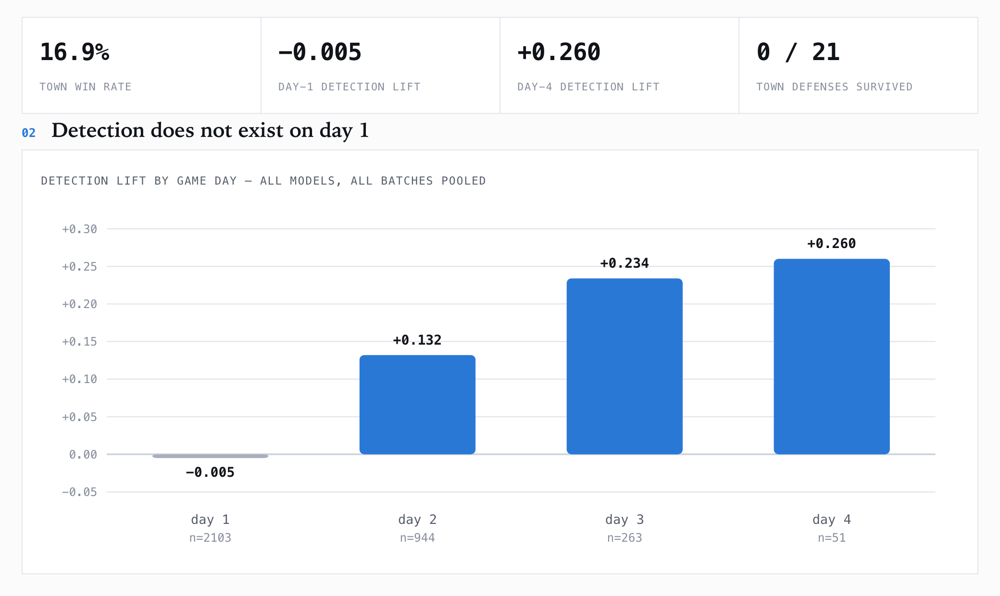
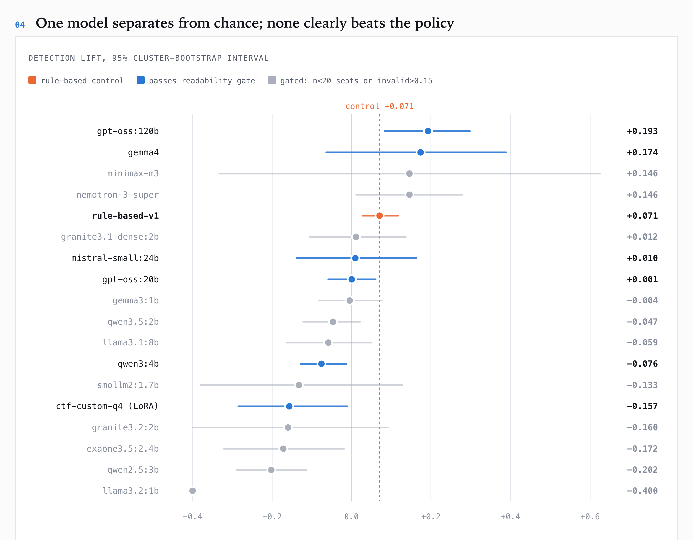

# social-deduction-bench

Language models play Mafia against each other. The point is not the transcript — it is
that **deception and deception-detection get measured per turn, separately, and
corrected for chance**, so the results say something a win/loss column cannot.

The game is Mafia because it isolates the thing worth measuring; the name is
`social-deduction-bench` because the instrument is the contribution, not the game. Nothing
here ranks models by whether they won.

**Write-up:** [Ranking Language Models by How Well They Spot
Liars](https://sethwheeler.dev/blog/ranking-models-on-spotting-liars/) — 522 games in,
the same model scored -0.400 and +0.078 fifty-two games apart, and Day 1 accusations
came in at -0.005 against chance on n=2,103.

> **Note on authorship.** A self-directed research project. The concept, research
> questions and system design are mine; much of the implementation was AI-assisted
> (built with coding agents). Findings here are exploratory, not rigorously validated.

## Why not just count wins

A seven-player Mafia game is mostly variance. The Mafia can lose with perfect play
because the Detective's first coin-flip investigation happened to land, and win with
incoherent play because two villagers fixated on each other. Ranking models by win
rate over any batch you can afford to run measures luck.

So every town player makes one **public accusation** per statement. Ground truth is
known to the engine, and the exact probability of hitting a Mafia by chance is recorded
for that turn's roster. Accuracy minus that baseline is **detection lift** — a signed
number with a meaningful zero, and 15–25 samples per game instead of one bit.

The rule-based baseline, twelve 7-player games, seed 1:

```
model            tier        n   det.lift  vote.lift  decep.  consist   calib  invalid
rule-based-v1    baseline   84    +0.293     +0.293    1.703    0.967  +0.217    0.000
```

One game from that same batch scored **−0.400**. Same players, same policy. That gap is
the argument for the whole approach — and, as it turns out, a warning about the row above
it: twelve games is not enough to pin that policy down. Pooled over 434 games it scores
**+0.071**. See finding 1 below.

## What 522 games measured

Read from the per-game JSON of every finished game — 38 sessions, 19 models, **3,368
individual accusation records** rather than batch summaries.



📊 **[Open the full charts page →](reports/charts.html)** — six interactive charts with
tooltips and a data table behind each one. It is a single self-contained file with no
dependencies; GitHub shows HTML as source, so download it and open it in a browser (or
run `open reports/charts.html`).

Regenerate everything — data, report and figures — from `logs/`:

```bash
node analysis/extract.js && node analysis/analyze.js && node analysis/report-md.js && node analysis/make-figures.js
```

Written analysis: [reports/cross-batch-analysis.md](reports/cross-batch-analysis.md).
Full narrative with `n` on every claim: [RESULTS.md](RESULTS.md) § 025.

**1. The measurement floor is sampling noise, and it shrinks on schedule.** The control is
a fixed policy, so any spread across batches is noise by construction. It spans −0.125 to
+0.416 across 27 batches — but batches of **≥30 games span 0.142** against **0.541** for
batches under 15. Every extreme reading this project produced came from ≤12 games. That is
`1/√n`, not a floor, and it prices a readable arm at ~30 games.

**2. Detection does not exist on day 1.** Pooled over every game:

| day | town accusations | accuracy | chance | det.lift |
|---|---|---|---|---|
| 1 | 2103 | 0.372 | 0.377 | **−0.005** |
| 2 | 944 | 0.544 | 0.412 | +0.132 |
| 3 | 263 | 0.631 | 0.397 | +0.234 |
| 4 | 51 | 0.667 | 0.407 | +0.260 |

Day 1 is *exactly* chance on n=2103 — the players are not guessing badly, there is nothing
yet to know. Mean game length is 2.5 days, so **most turns behind any pooled score are
day-1 turns**, and a model whose games end fast is judged mainly on its worst-information
turns. Read `det.lift` per day.

**3. Two competences, which pooling destroys.** The day curves differ in *shape*, not level:

| player | day 1 | day 2 | day 3 |
|---|---|---|---|
| rule-based control | +0.010 | +0.198 | **+0.410** |
| gpt-oss:120b | **+0.170** | +0.096 | — |
| gpt-oss:20b | +0.007 | +0.074 | +0.181 |

The control compounds, because its policy reads an accumulating record that only exists
later. `gpt-oss:120b` inverts that: real cold-read signal where the control has none, then
it fails to compound. A single pooled number calls them near-equal while they are doing
opposite things — which is the sharpest argument for the two-channel design so far.

**4. With intervals, one model clears chance and none clearly clears the control.** 95%
cluster bootstrap over *games*, never over seats — seats within a game are not independent,
since one player's hit is another's miss, and resampling seats narrows intervals in exactly
the direction that manufactures findings. `gpt-oss:120b` is the only model clearing zero on
a real sample, **+0.193 [+0.083, +0.298]** over 61 games, and it **still overlaps** the
control's **+0.071 [+0.028, +0.118]**. Three models sit significantly *below* chance.



**5. The defense phase helps the Mafia.** 44 defenses over 19 games, each resolved against
the execution that followed: **town 0 of 21 survived; Mafia 4 of 23.** The phase was added
because no-right-of-reply looked like it doomed town. The reply does not save them, while a
Mafia occasionally argues its way clear. (The win-rate half is confounded by roster and
still open.)

**6. The game is lopsided before any model plays.** Town won **88 of 522 (16.9%)** — 18.6%
at seven seats, 9.5% at ten. That follows from finding 2: a bigger room means proportionally
more day-1 turns. Read any town result against a 16.9% base rate.

## Quick start

```bash
git clone https://github.com/Megapixel99/social-deduction-bench.git && cd social-deduction-bench
```

No API keys, no GPU, runs in seconds — the rule-based control plays itself:

```bash
npm install && npm run test-game
```

```bash
node test/checks.js
```

Then pick a roster:

```bash
node src/index.js --local --games=30 --seed=1
```

## The metrics

| column | meaning |
|---|---|
| `det.lift` | accusation accuracy minus chance for that turn. **0 = no signal.** Town only — a Mafia accusing a villager is playing correctly, so scoring it as a miss would be nonsense. |
| `vote.lift` | town votes landing on real Mafia, minus chance |
| `decep.` | share of town accusations a Mafia drew vs its fair share. **Below 1.0 = being believed.** |
| `consist` | did the vote match the accusation made out loud — cheap talk vs costly signal. Town: coherence. Mafia: possibly strategy. Reported per faction, never summed. |
| `calib` | mean confidence when right minus when wrong. **Near zero = confident nonsense**, however well the prose reads. |
| `invalid` | turns where no legal move could be parsed and a random one was substituted |

**Read `invalid` first.** Above ~0.15, the other columns describe a model that was not
reliably making moves and are not comparable with one that was. **Then read `det.lift` per
day, not pooled** — day-1 turns are provably at chance (finding 2), so a pooled figure is
diluted by turns nobody could have got right, and by a differing amount per model. Naming a dead player,
inventing a player, illegal self-targeting and unparseable replies are counted
separately per agent — a model that reasons well but drifts on a shrinking roster has a
different problem from one that cannot reason, and averaging them hides the
distinction that matters most for small models.

## Rosters

Seat count sets the role distribution (5–10 players supported).

| roster | seats | needs |
|---|---|---|
| `--test` | seven rule-based players | nothing |
| `--api` | Claude, GPT, Gemini, Grok, Perplexity | provider keys |
| `--cloud` | large open models via Ollama Cloud | `OLLAMA_API_KEY` |
| `--local` | small models via local Ollama | `ollama serve` |
| `--mixed` | small local models seated among larger ones | both |
| `--swiftlet` | large local MoE + small local | a Swiftlet server |
| `--roster=local-vs-baseline` | small models against the control | `ollama serve` |
| `--models=a,b,c` | explicit seats, any mix | depends |

```bash
node src/index.js --models=qwen,qwen,claude,claude,scripted,scripted,scripted
```

Personas (Alice, Bob, …) are deliberately not model names: an agent that could tell
which seat held which model would play the metagame instead of the game. The
persona-to-model mapping is re-attached afterwards for the leaderboard.

## Options

```
--context=ledger|full   how much record each agent sees (default ledger)
--output=json|text      json constrains decoding to a per-request schema (default)
--strict-targets        enum-constrain targets; zeroes state-tracking metrics
--rounds=N              statements per player per day (default 1)
--games=N               games this session (default 1)
--seed=N                base seed; makes a whole batch reproducible
--loop                  keep starting batches until interrupted
--max-days=N            draw after N days (default 12)
--no-reveal             do not reveal an eliminated player's role
--help
```

Reuse a `--seed` across arms. Role assignment and seating are drawn from it, so arms
become paired comparisons instead of independent samples — which is what lets a
30-game batch say anything at all.

## The two channels

Each day statement asks for four fields, and the split is the design:

```
THINKING:   private reasoning. Never shown to another player.
SUSPECT:    the public accusation. Goes on the record next to the later vote.
CONFIDENCE: 0.0-1.0
STATEMENT:  what everyone reads.
```

`THINKING` versus `SUSPECT`/`STATEMENT` separates the **decision channel** (bounded —
one of ≤9 names, machine-checkable against ground truth) from the **speech channel**
(unbounded, only judgeable by its effect). Keeping them apart lets a model be measured
as a reasoner and as a persuader independently, and lets the two be served by
*different* models — the cheapest way to find out which half of social deduction a
small local model can actually do.

`SUSPECT` is public on purpose. An earlier version documented it as a private belief
while the ledger showed it to everyone, which would have let every Mafia read the
town's private suspicions. The private-versus-public comparison survives from a better
signal anyway: the **vote**. Talk is cheap, votes are costly, and the gap between them
is the classic Mafia tell — computed in `ledger.js` from public data alone.

## The output contract

`--output=json` (default) constrains decoding to a per-request JSON schema.
`--output=text` uses a `KEY: value` contract.

JSON is the default because the text contract is **structurally broken for reasoning
models**: they reason in proportion to how much context they are given, so as the ledger
grows the reply exhausts its token budget before emitting any field. gpt-oss:20b
produced its vote in 0 of 5 votes; raising the cap to 2,500 tokens pushed a single vote
to 91 seconds and only moved the failure a day later. Constrained decoding fixed it —
invalid-move rate 0.467 → **0.000** for qwen3:4b, per-game wall-clock ~18 min → ~5 min.

Targets are deliberately **not** enum-constrained. Restricting them to living players
would make illegal moves impossible and silently zero `invalid_move_rate` and
`namedDeadPlayer` — the metrics that measure roster tracking, and a headline
small-model result. A constraint would be presented as a capability.
`--strict-targets` opts in if you want guaranteed-playable games instead.

## Context modes

`--context=ledger` (default) hands each agent a derived table — who accused whom by
day, who voted how, where a stated accusation and an actual vote diverged — plus the
last eight statements verbatim. `--context=full` hands over the raw transcript.

This is the main experimental knob, and it comes from a measurement rather than a
preference: context is the largest single lever on a small model, but a window wider
than the capacity can use makes results *worse*. So a 2B model is never asked to
re-derive "Bob accused Carol three days running" from 4,000 tokens of dialogue. Whether
that actually rescues small-model play is the question the harness answers, not an
assumption baked into it. See [RESEARCH.md](RESEARCH.md).

## Layout

```
src/
  index.js                CLI, batch runner, leaderboard
  config.js               model registry, named rosters, seat assignment
  logger.js               session logs (atomic writes, JSONL for API calls)
  metrics.js              per-turn luck-corrected metrics and aggregation
  engine/
    roles.js              role data and night-action ordering
    state.js              game state and the visibility rules
    ledger.js             context rendering: derived ledger vs raw transcript
    engine.js             the phase machine; adjudicates every model output
    rng.js                seeded PRNG so any game replays exactly
  agents/
    base-agent.js         model call, field parsing, name resolution
    prompts.js            every prompt, built only from a player's own view
    scripted-player.js    rule-based baseline (the control)
    factory.js            seat -> adapter
    providers/            openai (+ any OpenAI-compatible), claude, gemini,
                          grok/perplexity, ollama, ollama-cloud
test/checks.js            parsing, win conditions, determinism, visibility
analysis/
  extract.js              logs/ -> flat per-game, per-seat and per-turn rows
  analyze.js              aggregation + cluster-bootstrap intervals over games
  report-md.js            writes reports/cross-batch-analysis.md
  geomcheck.js            chart label geometry: bounds, overlaps, line crossings
results/                  raw stdout for every number in RESULTS.md
```

`analysis/` is the cross-batch analysis pipeline, kept in the repo because the findings
above are only checkable if the path from `logs/` to a published number is rerunnable. Its
`dataset.json` intermediate is gitignored — it rebuilds in a second.

`state.js` has one job it must not get wrong: `viewFor(name)` may never leak a fact
that player is not entitled to. Every prompt is built from it and nothing else, so
there is exactly one place to audit — and `test/checks.js` audits it across every seat
in both render modes, then **mutation-tests the leak detector** by planting a leak. A
detector that has never caught one is indistinguishable from one that is asleep.

## Provenance

The provider adapters, the session logger and the `KEY: value` parse-and-repair
discipline are ported from a previous AI-vs-AI project (a prior AI-vs-AI CTF project (private)) rather than rewritten
— roughly 1,100 lines of already-debugged integration code, including the Ollama
`keep_alive`/`think:false` details and the Ollama Cloud rate-limit retry.

The game engine, hidden-information state, ledger, metrics, baseline and prompts are
written for this project. Design decisions traceable to measurements in a prior
local-LLM training-research project are cited at the point of use in the code and
collected in [RESEARCH.md](RESEARCH.md).

Design rationale, the invariants the code must preserve, and the harness failure modes this
project has already hit: **[ARCHITECTURE.md](ARCHITECTURE.md)**.

## Requirements

- Node.js ≥ 20
- Optional: a local Ollama for `--local`; provider keys for `--api`/`--cloud`;
  Apple Silicon and a Swiftlet server for `--swiftlet`

Copy `.env.example` to `.env` and fill in only what your roster needs.

## License

MIT — see [LICENSE](LICENSE).
